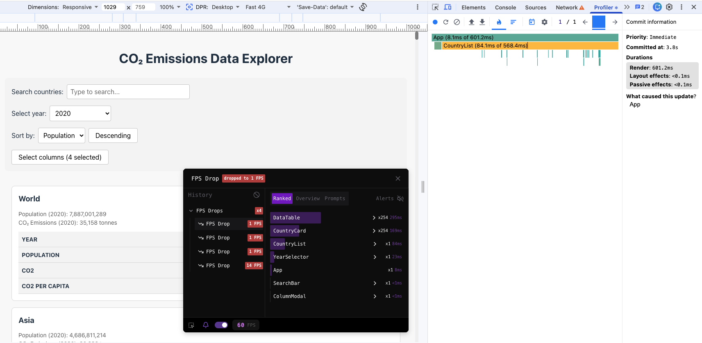
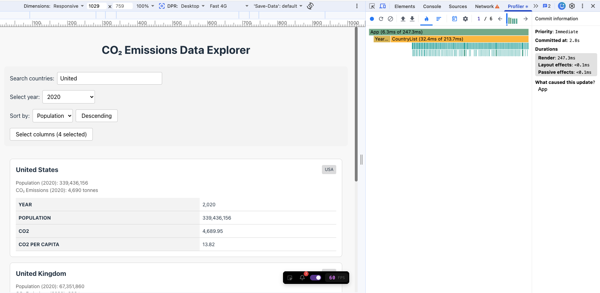
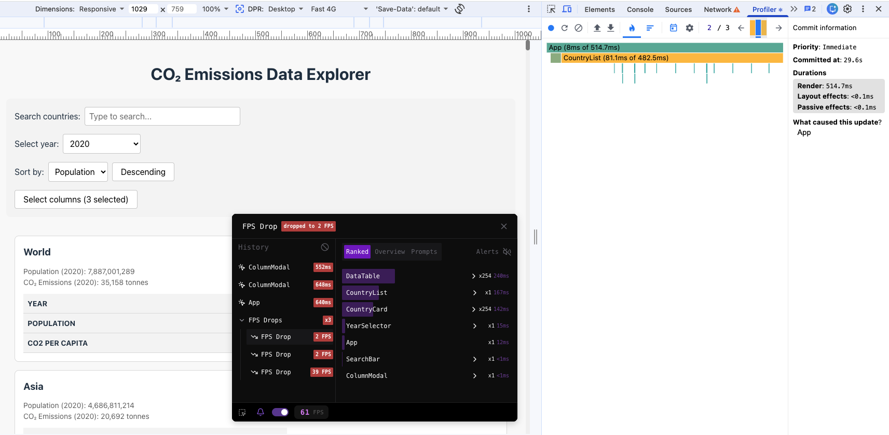
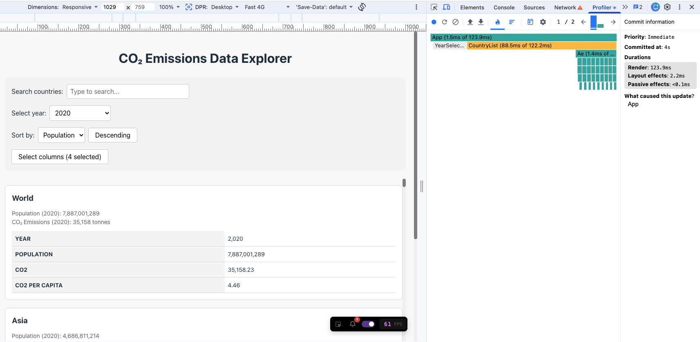
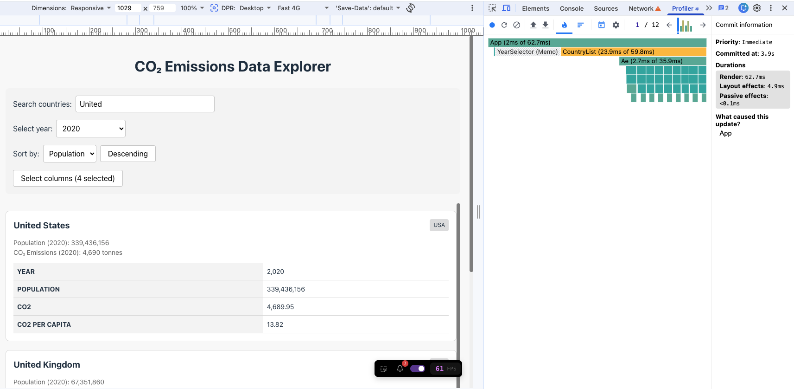
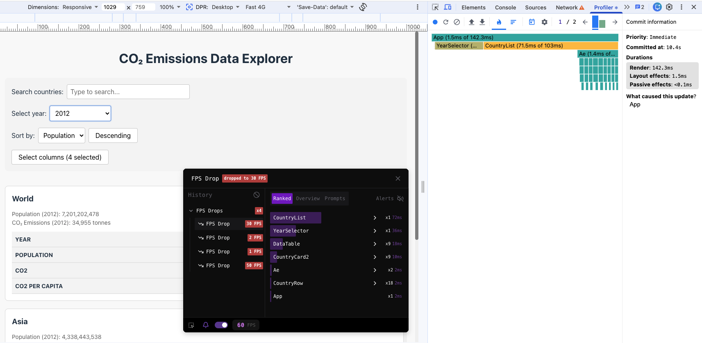
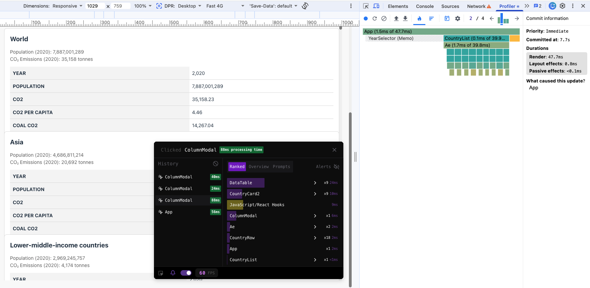

# Performance Optimization Report

## Baseline Measurements

### Interaction A: Sort countries

- **Commit duration**: 0.0002 s
- **Render duration**: 601.2 ms
- **Screenshot**: 

### Interaction B: Search countries

- **Commit duration**: 0.0002 s
- **Render duration**: 247.3 ms
- **Screenshot**: 

### Interaction C: Change year

- **Commit duration**: 0.0002 s
- **Render duration**: 552.9 ms
- **Screenshot**: 

### Interaction D: Toggle column

- **Commit duration**: 0.0002 s
- **Render duration**: 514.7 ms
- **Screenshot**: 

## Optimized Measurements

### Interaction A: Sort countries

- **Commit duration**: 0.0023 s
- **Render duration**: 123 ms
- **Screenshot**: 

### Interaction B: Search countries

- **Commit duration**: 0.005 s
- **Render duration**: 62.7 ms
- **Screenshot**: 

### Interaction C: Change year

- **Commit duration**: 0.0016 s
- **Render duration**: 142.3 ms
- **Screenshot**: 

### Interaction D: Toggle column

- **Commit duration**: 0.0009 s
- **Render duration**: 47.7 ms
- **Screenshot**: 

## Summary of Improvements

| Interaction      | Baseline (ms) | Optimized (ms) | Improvement |
| ---------------- | ------------- | -------------- | ----------- |
| Sort countries   | 601.2         | 123            | 79.5%       |
| Search countries | 247.3         | 62.7           | 74.7%       |
| Change year      | 552.9         | 142.3          | 74.3%       |
| Toggle column    | 514.7         | 47.7           | 90.7%       |
| **Average**      | **479.0**     | **93.9**       | **80.4%**   |